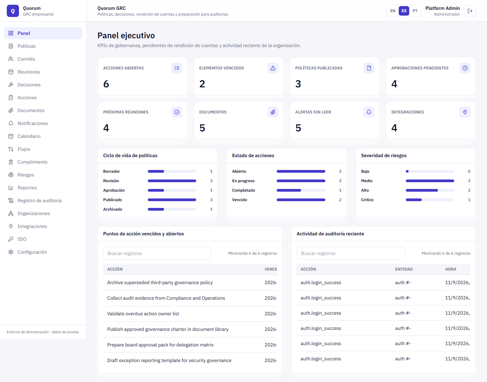
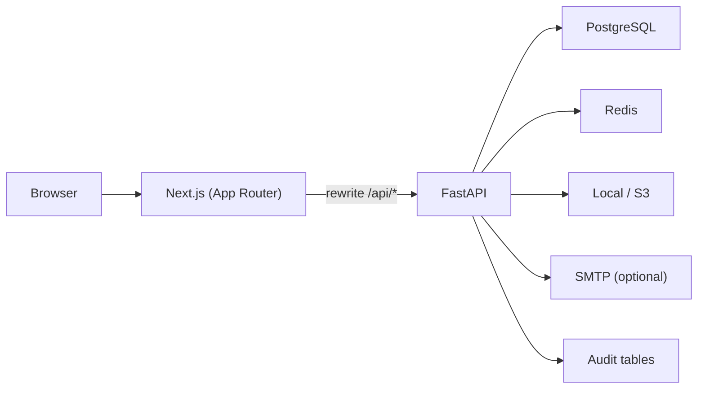

# Quorum GRC

[Español](README.md) · **English**

[](https://github.com/ReneeeeeDev/quorum-grc/actions/workflows/ci.yml)

An enterprise **governance, risk, and compliance (GRC)** portal built full-stack with Next.js and FastAPI. It centralizes the policy lifecycle, committees, meetings, decisions, action plans, compliance obligations, the risk register, documents, and audit traceability in a single multi-tenant dashboard with role-based access control.

> Portfolio project in MVP state. It boots with automatically seeded demo data and is not meant for real company data without the production setup described below.


<!-- TODO: add live demo links (Vercel frontend, Render backend) once deployed -->

## Table of contents

- [What it solves](#what-it-solves)
- [Stack](#stack)
- [Features](#features)
- [Roles and visibility](#roles-and-visibility)
- [Languages](#languages)
- [Architecture](#architecture)
- [Repository layout](#repository-layout)
- [Getting started](#getting-started)
- [Demo accounts](#demo-accounts)
- [Verification and testing](#verification-and-testing)
- [Deployment](#deployment)
- [Security](#security)
- [Known limitations](#known-limitations)
- [Documentation](#documentation)
- [Origin](#origin)

## What it solves

Many organizations run governance on spreadsheets, shared drives, and email approvals. That makes it hard to know which policy is in force, who approved it, what each committee decided, and which actions are still open. Quorum GRC replaces that scattered process with a single control center where every change is recorded and every role sees exactly what it is entitled to.

## Stack

| Layer | Technologies |
| --- | --- |
| Frontend | Next.js 15 (App Router), React 19, TypeScript, Tailwind CSS, lucide-react, IBM Plex Sans via `next/font` |
| Backend | FastAPI, SQLAlchemy 2, Pydantic 2, Alembic, python-jose (JWT), bcrypt |
| Data | PostgreSQL 16, Redis 7 |
| Storage | Local filesystem or any S3-compatible bucket (boto3) |
| Testing | Playwright (E2E), `TestClient` smoke tests, per-role QA scripts |
| Infrastructure | Docker Compose, GitHub Actions, Render blueprint, Vercel |

## Features

### Governance

- Policies with a full lifecycle: `draft → review → approval → published → archived`, versioning, and effective date.
- Ordered approval workflow steps with an assigned approver and comments.
- Committees/departments with a head, meetings with agenda and minutes, decisions linked to meetings, and action items derived from each decision.
- Governance calendar (meetings, reviews, audits, renewals) with `.ics` export.

### Risk and compliance

- Risk register with category, severity, status, owner, and mitigation plan.
- Compliance obligations with source, due date, status, and a linked evidence document.
- External integration registry with a sync-run history.

### Operations

- Document library with file upload and download, linkable to policies, meetings, or decisions.
- Notifications with read/unread state and email dispatch (SMTP), recording every delivery attempt.
- Executive reports with KPIs, status/severity breakdowns, and CSV export.
- Audit log of every mutating action (actor, entity, detail, timestamp) with filters and CSV export.
- Multi-tenant: every record belongs to an organization and queries are scoped in the backend.
- Administration of tenants, users, SSO providers (simulated SAML handoff), and password reset.
- Server-side pagination (`limit`/`offset` + `X-Total-Count` header) on every list.
- UI in **English, Spanish, and Portuguese**, with browser-language detection and a persisted switcher.

## Roles and visibility

Access control is enforced in the backend at two levels: FastAPI dependencies that restrict who can write, and a `scoped_query` that filters every query by the user's role and tenant ([governance.py](backend/app/api/routes/governance.py)).

| Role | Scope |
| --- | --- |
| **Admin** | Full access across all tenants. The only role that manages tenants, integrations, SSO, and users. |
| **Governance Officer** | Full read/write within their own tenant. |
| **Manager** | Read/write only on their own records: policies they own, their committee's meetings, assigned actions, uploaded documents, risks and obligations they own. |
| **Auditor** | Read-only over policies, committees, meetings, decisions, documents, compliance, risks, and the audit log. |
| **Board Member** | Read-only over **published** policies, committees, meetings, decisions, calendar, and linked documents. |

The frontend sidebar is built from the same role map, so each user only sees the modules they can access.

## Languages

The UI is available in English (default), Spanish, and Portuguese. The language is detected from the browser on the first visit, can be changed from the `EN · ES · PT` switcher in the header (and on the login page), and is remembered in `localStorage`.

- Small in-house implementation in [lib/i18n.tsx](frontend/lib/i18n.tsx): an `I18nProvider`, the `useI18n()` hook, and a `t()` function with interpolation (`t("Page {current} of {pages}", { current, pages })`).
- *gettext* style: the English string is the key, so the code reads naturally and any untranslated key falls back to English without breaking anything.
- Backend status values (`in_progress`, `published`…) become translatable labels through `statusLabel()`, and dates use `Intl` with the active `locale`.
- `npm run i18n:check` compares every `t("…")` call in the code with each dictionary and fails CI when a key is missing or unused.

To add a language: create `frontend/lib/locales/<code>.ts` by copying [es.ts](frontend/lib/locales/es.ts), register it in the `languages` list in `lib/i18n.tsx`, and run `npm run i18n:check`.



## Architecture



- The frontend always calls `/api/*` on its own origin; `next.config.ts` rewrites those routes to `NEXT_BACKEND_URL`, which avoids CORS issues both locally and on Vercel.
- The backend exposes ~50 REST endpoints under `/api`, with Pydantic schemas for input and output and auto-generated docs at `/docs`.
- A middleware adds security headers, `X-Request-ID`, and per-IP/per-route rate limiting (stricter on `/api/auth/login`).
- On startup the backend creates the tables and, when `DEMO_SEED_ENABLED=true`, seeds two tenants, ten users, and sample data for every module.
- The backend container runs Alembic migrations before starting `uvicorn`.

## Repository layout

```text
frontend/     Next.js application (app/, components/, lib/, tests/)
backend/      FastAPI application (app/api, app/core, app/models, app/schemas, app/services, alembic/)
docs/         Product, architecture, API, deployment, monitoring, verification
screenshots/  Full screenshot pack per module and per role
scripts/      Role QA, production smoke test, screenshot capture
database/     Database and seed notes
docker/       Infrastructure notes
```

## Getting started

### Option A — Everything with Docker Compose

```bash
docker compose up --build
```

Starts PostgreSQL, Redis, the backend (with migrations and demo seed), and the frontend. Open `http://localhost:3000`.

### Option B — Local development

1. Copy the environment files:

   ```bash
   cp backend/.env.example backend/.env
   cp frontend/.env.example frontend/.env.local
   ```

2. Start only the database and Redis:

   ```bash
   docker compose up -d postgres redis
   ```

3. Backend:

   ```bash
   cd backend
   python -m venv .venv
   # Windows: .venv\Scripts\activate   |   macOS/Linux: source .venv/bin/activate
   pip install -r requirements.txt
   uvicorn app.main:app --reload
   ```

4. Frontend (in another terminal):

   ```bash
   cd frontend
   npm install
   npm run dev
   ```

Default URLs: frontend at `http://127.0.0.1:3000`, backend at `http://127.0.0.1:8000` (Swagger at `/docs`).

## Demo accounts

Available when `DEMO_SEED_ENABLED=true` (the default in development).

| Role | Email | Password |
| --- | --- | --- |
| Admin | `admin@quorum.local` | `Admin@123` |
| Governance Officer | `governance@quorum.local` | `Governance@123` |
| Manager | `manager@quorum.local` | `Manager@123` |
| Auditor | `auditor@quorum.local` | `Auditor@123` |
| Board Member | `board@quorum.local` | `Board@123` |

The seed also creates Legal, Security, and Risk managers, plus a second tenant (*Northwind Public Services*) with its own Governance Officer and Auditor to exercise cross-organization isolation. The full list lives in [seed.py](backend/app/services/seed.py).

## Verification and testing

```bash
# Backend: end-to-end smoke test against in-memory SQLite (login, record counts, security headers)
cd backend && python scripts/smoke_check.py

# Frontend: types, translation dictionaries, and build
cd frontend && npm run typecheck && npm run i18n:check && npm run build

# Frontend: Playwright E2E (mocked API, desktop + mobile)
cd frontend && npx playwright install chromium && npm run test:e2e

# Per-role permission QA against a running backend
ROLE_QA_BACKEND_URL=http://127.0.0.1:8000 node scripts/role-qa.mjs
```

The GitHub Actions workflow ([ci.yml](.github/workflows/ci.yml)) runs these same checks on every push and pull request: backend smoke, frontend typecheck + `i18n:check` + build, Playwright, and script validation.

## Deployment

The reference setup is **Vercel** (frontend) + **Render** (backend, via [render.yaml](render.yaml)) + **Supabase** (PostgreSQL). The step-by-step guide is in [docs/deploy-vercel-render-supabase.md](docs/deploy-vercel-render-supabase.md); other options are covered in [docs/deployment.md](docs/deployment.md).

Key points for a real environment:

- Use [backend/.env.production.example](backend/.env.production.example) as the secrets template.
- Set `DEMO_SEED_ENABLED=false` and create the first admin with `python backend/scripts/create_admin.py`.
- Set `NEXT_BACKEND_URL` on the frontend and `FRONTEND_ORIGIN` on the backend.
- Review `GET /api/ops/production-readiness` as an Admin before handoff.
- After every deploy, run `scripts/production-smoke.mjs` and the checks in the [monitoring runbook](docs/monitoring.md).

## Security

- JWT authentication (HS256) with configurable expiry; passwords hashed with bcrypt.
- Two-layer authorization: per-role dependencies for write/admin operations, and role- and tenant-scoped query filtering.
- Per-IP/per-route rate limiting with a lower threshold on login.
- `X-Content-Type-Options`, `X-Frame-Options`, `Referrer-Policy`, and `Permissions-Policy` headers on every response.
- Audit logging of login attempts (successful and failed), logout, and every write operation.
- Password reset with hashed, single-use, expiring tokens.
- Optional Sentry integration via `SENTRY_DSN`.

## Known limitations

These are deliberate MVP boundaries, not blocking defects. Full detail in [docs/known-limitations.md](docs/known-limitations.md).

- The JWT is stored in `localStorage`; there are no refresh tokens or rotation.
- SSO login is a handoff simulation: real SAML/OIDC assertions are not validated.
- Notification dispatch is synchronous and requires SMTP; there is no job queue.
- Table search is local to the loaded page.
- Backend error messages and seeded demo data are English-only.
- No document preview or version history.

## Documentation

| Document | Contents |
| --- | --- |
| [Project guide](docs/project-guide.md) | Full picture: product, domain, modules, scripts, and status |
| [Product brief](docs/product-brief.md) | Problem, users, and value proposition |
| [Architecture](docs/architecture.md) | Components and data model |
| [API reference](docs/api.md) | Endpoints, authentication, and pagination |
| [Verification](docs/verification.md) · [Release](docs/release-verification.md) | Quality and release checklists |
| [Deployment](docs/deployment.md) · [Vercel + Render + Supabase](docs/deploy-vercel-render-supabase.md) | Options and step-by-step guide |
| [Monitoring](docs/monitoring.md) · [Hardening](docs/production-hardening.md) · [Data policy](docs/data-policy.md) | Production operations |
| [Demo script](docs/demo-script.md) | 5-minute walkthrough per role |
| [Known limitations](docs/known-limitations.md) | MVP scope and future work |

## Origin

This project started from a public MVP on GitHub and was rebranded and adapted for this portfolio.
