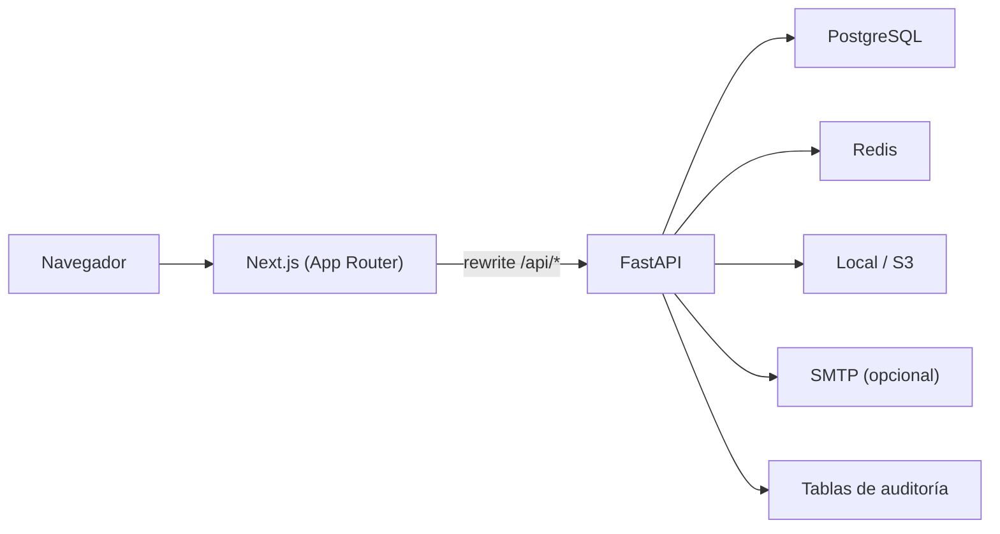

# Quorum GRC

**Español** · [English](README.en.md)

[](https://github.com/ReneeeeeDev/quorum-grc/actions/workflows/ci.yml)

Portal empresarial de **gobernanza, riesgo y cumplimiento (GRC)** construido full-stack con Next.js y FastAPI. Centraliza el ciclo de vida de políticas, comités, reuniones, decisiones, planes de acción, obligaciones de cumplimiento, registro de riesgos, documentos y trazabilidad de auditoría en un único panel multi-tenant con control de acceso por rol.

> Proyecto de portafolio en estado MVP. Arranca con datos de demostración sembrados automáticamente y no está pensado para datos reales sin la configuración de producción descrita más abajo.


<!-- TODO: añadir enlaces al demo en vivo (frontend en Vercel, backend en Render) una vez desplegado -->

## Índice

- [Qué resuelve](#qué-resuelve)
- [Stack](#stack)
- [Funcionalidades](#funcionalidades)
- [Roles y visibilidad](#roles-y-visibilidad)
- [Idiomas](#idiomas)
- [Arquitectura](#arquitectura)
- [Estructura del repositorio](#estructura-del-repositorio)
- [Puesta en marcha](#puesta-en-marcha)
- [Cuentas de demostración](#cuentas-de-demostración)
- [Verificación y pruebas](#verificación-y-pruebas)
- [Despliegue](#despliegue)
- [Seguridad](#seguridad)
- [Limitaciones conocidas](#limitaciones-conocidas)
- [Documentación](#documentación)
- [Origen](#origen)

## Qué resuelve

Muchas organizaciones gestionan su gobernanza con hojas de cálculo, carpetas compartidas y aprobaciones por correo. Eso hace difícil saber qué política está vigente, quién la aprobó, qué decidió cada comité y qué acciones siguen pendientes. Quorum GRC reemplaza ese proceso disperso por un centro de control único donde cada cambio queda registrado y cada rol ve exactamente lo que le corresponde.

## Stack

| Capa | Tecnologías |
| --- | --- |
| Frontend | Next.js 15 (App Router), React 19, TypeScript, Tailwind CSS, lucide-react, IBM Plex Sans vía `next/font` |
| Backend | FastAPI, SQLAlchemy 2, Pydantic 2, Alembic, python-jose (JWT), bcrypt |
| Datos | PostgreSQL 16, Redis 7 |
| Almacenamiento | Sistema de archivos local o bucket compatible con S3 (boto3) |
| Pruebas | Playwright (E2E), smoke tests con `TestClient`, scripts de QA por rol |
| Infraestructura | Docker Compose, GitHub Actions, blueprint de Render, Vercel |

## Funcionalidades

### Gobernanza

- Políticas con ciclo de vida completo: `draft → review → approval → published → archived`, versionado y fecha de vigencia.
- Flujo de aprobación por pasos ordenados con aprobador asignado y comentarios.
- Comités/departamentos con responsable, reuniones con agenda y actas, decisiones vinculadas a reuniones y planes de acción derivados de cada decisión.
- Calendario de gobernanza (reuniones, revisiones, auditorías, renovaciones) con exportación a `.ics`.

### Riesgo y cumplimiento

- Registro de riesgos con categoría, severidad, estado, responsable y plan de mitigación.
- Obligaciones de cumplimiento con origen, vencimiento, estado y documento de evidencia asociado.
- Registro de integraciones externas con historial de ejecuciones de sincronización.

### Operación

- Biblioteca de documentos con subida de archivos y descarga, enlazables a políticas, reuniones o decisiones.
- Notificaciones con estado leído/no leído y envío por correo (SMTP) con registro de cada intento de entrega.
- Reportes ejecutivos con KPIs, desgloses por estado/severidad y exportación CSV.
- Registro de auditoría de toda acción mutante (actor, entidad, detalle, fecha) con filtros y exportación CSV.
- Multi-tenant: cada registro pertenece a una organización y las consultas se acotan en el backend.
- Administración de tenants, usuarios, proveedores SSO (handoff SAML simulado) y restablecimiento de contraseña.
- Paginación en servidor (`limit`/`offset` + cabecera `X-Total-Count`) en todas las listas.
- Interfaz en **inglés, español y portugués**, con detección automática del idioma del navegador y selector persistente.

## Roles y visibilidad

El control de acceso se aplica en el backend en dos niveles: dependencias de FastAPI que restringen quién puede escribir, y un `scoped_query` que filtra cada consulta según el rol y el tenant del usuario ([governance.py](backend/app/api/routes/governance.py)).

| Rol | Alcance |
| --- | --- |
| **Admin** | Acceso total a todos los tenants. Único rol que gestiona tenants, integraciones, SSO y usuarios. |
| **Governance Officer** | Lectura y escritura completas dentro de su tenant. |
| **Manager** | Lectura y escritura solo sobre sus propios registros: políticas que posee, reuniones de su comité, acciones asignadas, documentos subidos, riesgos y obligaciones a su cargo. |
| **Auditor** | Solo lectura sobre políticas, comités, reuniones, decisiones, documentos, cumplimiento, riesgos y registro de auditoría. |
| **Board Member** | Solo lectura de políticas **publicadas**, comités, reuniones, decisiones, calendario y documentos vinculados. |

La barra lateral del frontend se construye a partir del mismo mapa de roles, de modo que cada usuario solo ve los módulos a los que puede acceder.

## Idiomas

La interfaz está disponible en inglés (por defecto), español y portugués. El idioma se detecta del navegador en la primera visita, se puede cambiar desde el selector `EN · ES · PT` de la cabecera (y del login) y se recuerda en `localStorage`.

- Implementación propia y ligera en [lib/i18n.tsx](frontend/lib/i18n.tsx): un `I18nProvider`, el hook `useI18n()` y una función `t()` con interpolación (`t("Page {current} of {pages}", { current, pages })`).
- Estilo *gettext*: la cadena en inglés es la clave, así que el código se lee tal cual y cualquier clave sin traducción cae en inglés sin romper nada.
- Los estados del backend (`in_progress`, `published`…) se convierten en etiquetas traducibles con `statusLabel()`, y las fechas usan `Intl` con el `locale` activo.
- `npm run i18n:check` compara todas las llamadas `t("…")` del código con cada diccionario y falla en CI si falta o sobra alguna clave.

Para añadir un idioma: crea `frontend/lib/locales/<código>.ts` copiando [es.ts](frontend/lib/locales/es.ts), regístralo en la lista `languages` de `lib/i18n.tsx` y ejecuta `npm run i18n:check`.


## Arquitectura



- El frontend llama siempre a `/api/*` en su propio origen; `next.config.ts` reescribe esas rutas hacia `NEXT_BACKEND_URL`, lo que evita problemas de CORS en desarrollo y en Vercel.
- El backend expone ~50 endpoints REST bajo `/api`, con esquemas Pydantic para entrada y salida, y documentación automática en `/docs`.
- Un middleware añade cabeceras de seguridad, `X-Request-ID` y limitación de tasa por IP y ruta (más estricta en `/api/auth/login`).
- Al arrancar, el backend crea las tablas y, si `DEMO_SEED_ENABLED=true`, siembra dos tenants, diez usuarios y datos de ejemplo para todos los módulos.
- El contenedor del backend ejecuta las migraciones de Alembic antes de iniciar `uvicorn`.

## Estructura del repositorio

```text
frontend/     Aplicación Next.js (app/, components/, lib/, tests/)
backend/      Aplicación FastAPI (app/api, app/core, app/models, app/schemas, app/services, alembic/)
docs/         Producto, arquitectura, API, despliegue, monitoreo, verificación
screenshots/  Capturas de pantalla completas por módulo y por rol
scripts/      QA por rol, smoke test de producción, captura de capturas de pantalla
database/     Notas de base de datos y seed
docker/       Notas de infraestructura
```

## Puesta en marcha

### Opción A — Todo con Docker Compose

```bash
docker compose up --build
```

Levanta PostgreSQL, Redis, el backend (con migraciones y seed de demo) y el frontend. Abre `http://localhost:3000`.

### Opción B — Desarrollo local

1. Copiar los archivos de entorno:

   ```bash
   cp backend/.env.example backend/.env
   cp frontend/.env.example frontend/.env.local
   ```

2. Levantar solo la base de datos y Redis:

   ```bash
   docker compose up -d postgres redis
   ```

3. Backend:

   ```bash
   cd backend
   python -m venv .venv
   # Windows: .venv\Scripts\activate   |   macOS/Linux: source .venv/bin/activate
   pip install -r requirements.txt
   uvicorn app.main:app --reload
   ```

4. Frontend (en otra terminal):

   ```bash
   cd frontend
   npm install
   npm run dev
   ```

URLs por defecto: frontend en `http://127.0.0.1:3000`, backend en `http://127.0.0.1:8000` (Swagger en `/docs`).

## Cuentas de demostración

Disponibles cuando `DEMO_SEED_ENABLED=true` (valor por defecto en desarrollo).

| Rol | Email | Contraseña |
| --- | --- | --- |
| Admin | `admin@quorum.local` | `Admin@123` |
| Governance Officer | `governance@quorum.local` | `Governance@123` |
| Manager | `manager@quorum.local` | `Manager@123` |
| Auditor | `auditor@quorum.local` | `Auditor@123` |
| Board Member | `board@quorum.local` | `Board@123` |

El seed también crea managers de Legal, Seguridad y Riesgos, y un segundo tenant (*Northwind Public Services*) con su propio Governance Officer y Auditor para probar el aislamiento entre organizaciones. La lista completa está en [seed.py](backend/app/services/seed.py).

## Verificación y pruebas

```bash
# Backend: smoke test end-to-end contra SQLite en memoria (login, conteos, cabeceras de seguridad)
cd backend && python scripts/smoke_check.py

# Frontend: tipos, diccionarios de traducción y build
cd frontend && npm run typecheck && npm run i18n:check && npm run build

# Frontend: E2E con Playwright (API mockeada, escritorio + móvil)
cd frontend && npx playwright install chromium && npm run test:e2e

# QA de permisos por rol contra un backend en ejecución
ROLE_QA_BACKEND_URL=http://127.0.0.1:8000 node scripts/role-qa.mjs
```

El workflow de GitHub Actions ([ci.yml](.github/workflows/ci.yml)) ejecuta estas mismas comprobaciones en cada push y pull request: smoke del backend, typecheck + `i18n:check` + build del frontend, Playwright y validación de scripts.

## Despliegue

La configuración de referencia es **Vercel** (frontend) + **Render** (backend, vía [render.yaml](render.yaml)) + **Supabase** (PostgreSQL). La guía paso a paso está en [docs/deploy-vercel-render-supabase.md](docs/deploy-vercel-render-supabase.md); otras opciones en [docs/deployment.md](docs/deployment.md).

Puntos clave para un entorno real:

- Usar [backend/.env.production.example](backend/.env.production.example) como plantilla de secretos.
- Poner `DEMO_SEED_ENABLED=false` y crear el primer administrador con `python backend/scripts/create_admin.py`.
- Definir `NEXT_BACKEND_URL` en el frontend y `FRONTEND_ORIGIN` en el backend.
- Revisar `GET /api/ops/production-readiness` como Admin antes de la entrega.
- Tras cada despliegue, ejecutar `scripts/production-smoke.mjs` y las comprobaciones del [runbook de monitoreo](docs/monitoring.md).

## Seguridad

- Autenticación JWT (HS256) con expiración configurable; contraseñas con bcrypt.
- Autorización en dos capas: dependencias por rol para escritura/administración y filtrado de consultas por rol y tenant.
- Limitación de tasa por IP y ruta, con umbral más bajo para el login.
- Cabeceras `X-Content-Type-Options`, `X-Frame-Options`, `Referrer-Policy` y `Permissions-Policy` en todas las respuestas.
- Registro de auditoría de intentos de login (exitosos y fallidos), logout y toda operación de escritura.
- Restablecimiento de contraseña con tokens hasheados, de un solo uso y con expiración.
- Integración opcional con Sentry mediante `SENTRY_DSN`.

## Limitaciones conocidas

Son límites intencionales del MVP, no defectos bloqueantes. Detalle completo en [docs/known-limitations.md](docs/known-limitations.md).

- El JWT se guarda en `localStorage`; no hay refresh tokens ni rotación.
- El login SSO es una simulación de handoff: no se validan aserciones SAML/OIDC reales.
- El envío de notificaciones es síncrono y requiere SMTP; no hay cola de trabajos.
- La búsqueda en tablas es local a la página cargada.
- Los mensajes de error del backend y los datos de demostración están solo en inglés.
- No hay previsualización ni versionado de documentos.

## Documentación

| Documento | Contenido |
| --- | --- |
| [Guía del proyecto](docs/project-guide.md) | Visión completa: producto, dominio, módulos, scripts y estado |
| [Product brief](docs/product-brief.md) | Problema, usuarios y propuesta de valor |
| [Arquitectura](docs/architecture.md) | Componentes y modelo de datos |
| [Referencia de API](docs/api.md) | Endpoints, autenticación y paginación |
| [Verificación](docs/verification.md) · [Release](docs/release-verification.md) | Checklists de calidad y de release |
| [Despliegue](docs/deployment.md) · [Vercel + Render + Supabase](docs/deploy-vercel-render-supabase.md) | Opciones y guía paso a paso |
| [Monitoreo](docs/monitoring.md) · [Hardening](docs/production-hardening.md) · [Política de datos](docs/data-policy.md) | Operación en producción |
| [Guion de demo](docs/demo-script.md) | Recorrido de 5 minutos por rol |
| [Limitaciones conocidas](docs/known-limitations.md) | Alcance del MVP y trabajo futuro |

## Origen

Este proyecto parte de un MVP público en GitHub, rebautizado y adaptado para este portafolio.
