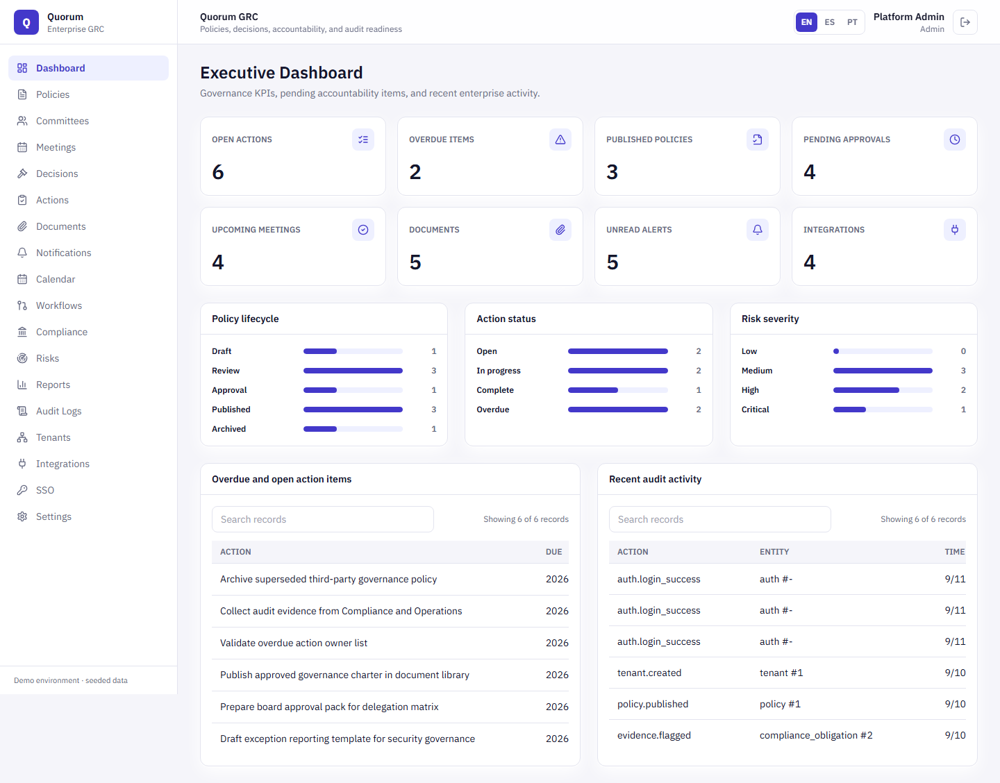
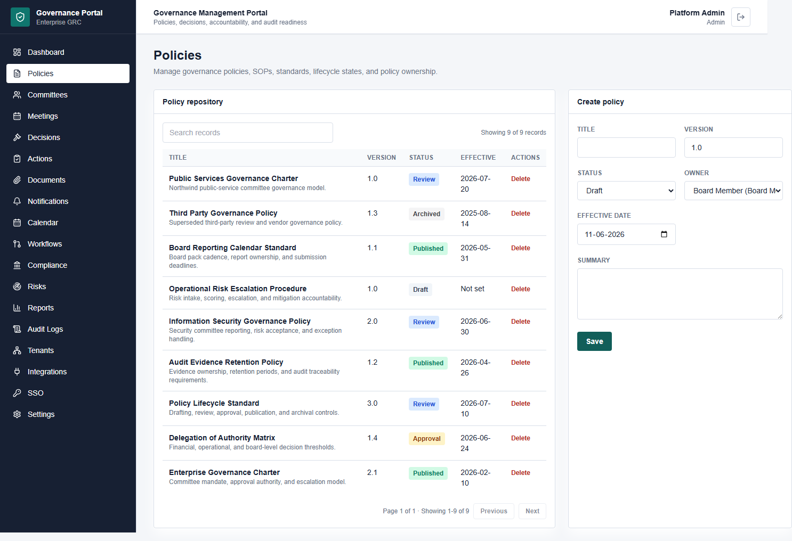
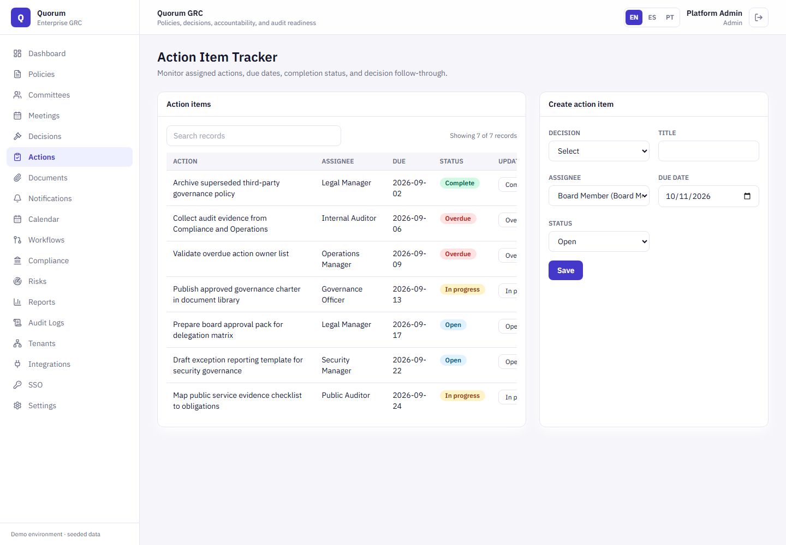
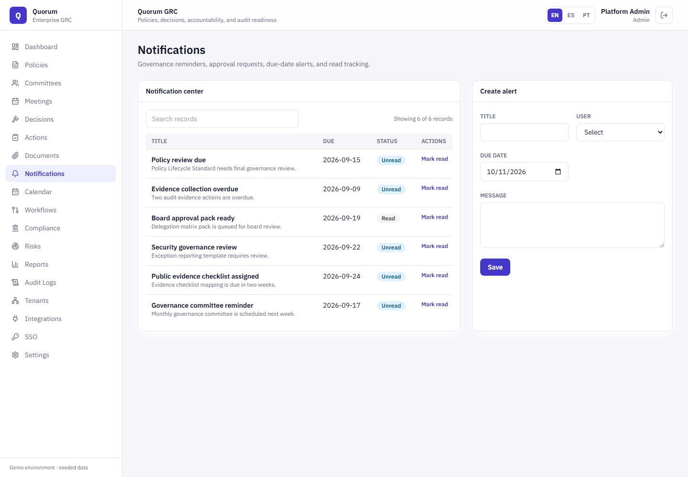
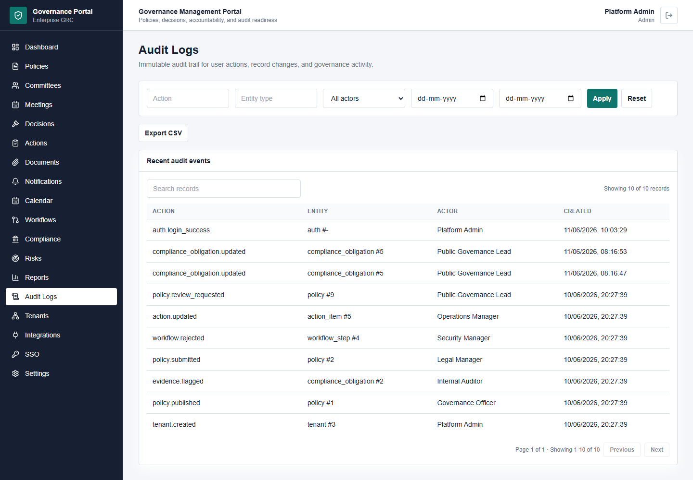
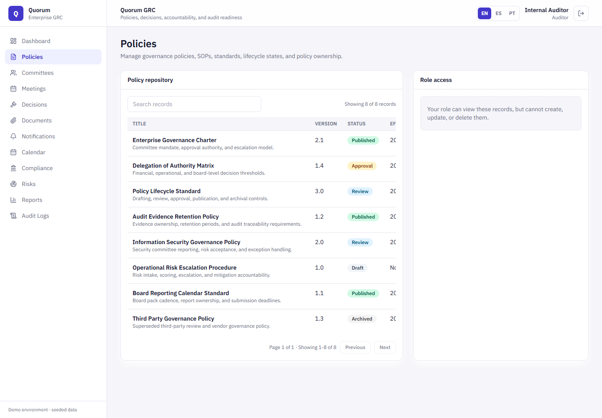
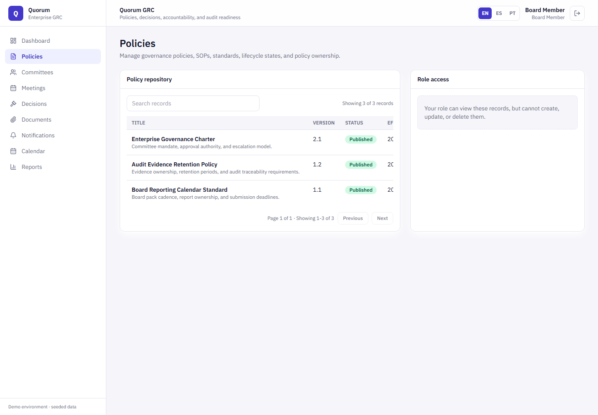
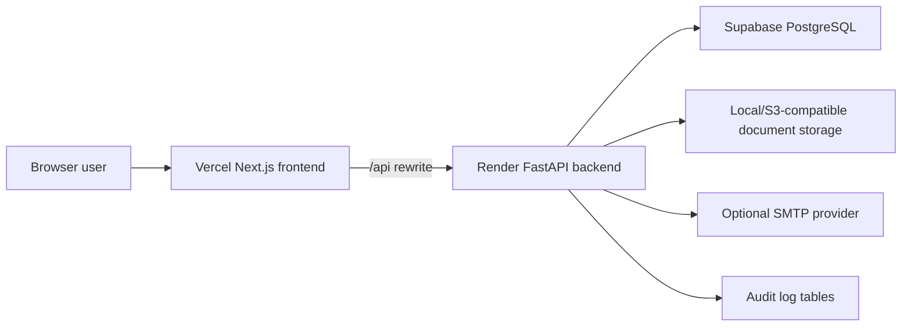

# Governance Management Portal

[](https://github.com/Sankrityayana/Governance-Management-Portal/actions/workflows/ci.yml)

A full-stack enterprise governance, risk, and compliance portal for managing policy lifecycles, committees, meetings, decisions, action items, audit logs, and executive reporting.

A centralized enterprise governance platform that helps organizations manage policies, committees, decisions, compliance obligations, governance frameworks, approvals, documentation, and organizational accountability.

## Project Status

This repository is complete as a portfolio/demo MVP.

- Live frontend is deployed on Vercel.
- Backend API is deployed on Render.
- PostgreSQL/Supabase is connected.
- GitHub Actions CI is configured and passing.
- Production smoke checks pass for the deployed demo.
- Final screenshot pack is available in `screenshots/`.
- Final MVP release tag: `v1.0.0-mvp`.

This is intentionally a demo/MVP project. It uses seeded demo data and is not intended for real company data without additional production account setup.

## Stack

- Frontend: Next.js, TypeScript, Tailwind CSS
- Backend: FastAPI, SQLAlchemy, Pydantic
- Database: PostgreSQL
- Cache: Redis
- Deployment baseline: Docker Compose

## What It Demonstrates

- Full-stack application architecture
- Authentication and JWT sessions
- Role-based access control
- Role-specific data visibility
- REST API design
- Dashboard and admin UI design
- Server-side pagination metadata
- Audit logging
- Deployment debugging
- CORS troubleshooting
- CI, smoke checks, and release verification
- Documentation and portfolio presentation

## Live Deployment

- Frontend: [Vercel](https://governance-management-portal-4g7p.vercel.app)
- Backend: [Render health check](https://governance-management-portal.onrender.com/health)
- Backend readiness: [Render database readiness](https://governance-management-portal.onrender.com/health/ready)

## Screenshots

The complete screenshot pack for LinkedIn/portfolio use is in `screenshots/`.

Dashboard overview:



Policy lifecycle with server-side pagination:



Action tracking:



Notifications and alert visibility:



Audit trail:



Auditor read-only role view:



Board member published-policy view:



## Architecture



## Repository Layout

```text
frontend/      Next.js application
backend/       FastAPI application
docs/          Product, architecture, deployment, and verification docs
screenshots/   Final portfolio screenshot pack
scripts/       QA, smoke-test, and screenshot automation scripts
database/      Database notes and seed guidance
docker/        Deployment and infrastructure notes
```

For a full explanation of the product, domain concepts, modules, architecture, scripts, and completion status, read [Project Guide](docs/project-guide.md).

## Local Development

1. Copy environment files:

   ```bash
   cp backend/.env.example backend/.env
   cp frontend/.env.example frontend/.env.local
   ```

2. Start PostgreSQL and Redis:

   ```bash
   docker compose up -d postgres redis
   ```

3. Run the backend:

   ```bash
   cd backend
   python -m venv .venv
   .venv\Scripts\activate
   pip install -r requirements.txt
   uvicorn app.main:app --reload
   ```

4. Run the frontend:

   ```bash
   cd frontend
   npm install
   npm run dev
   ```

The frontend calls same-origin `/api/*` by default and proxies those requests to `NEXT_BACKEND_URL`.

Default local URLs:

- Frontend: `http://127.0.0.1:3000`
- Backend: `http://127.0.0.1:8000`

## Production Notes

- Use `backend/.env.production.example` as the backend secret template.
- Set `DEMO_SEED_ENABLED=false` for real production data.
- Create the first named production admin with `backend/scripts/create_admin.py` when demo seeding is disabled.
- Set `NEXT_BACKEND_URL` for the frontend server to reach the backend.
- Review `GET /api/ops/production-readiness` as an Admin user before handoff.
- The backend container runs Alembic migrations before starting.
- See [Deployment](docs/deployment.md) for platform options.
- For the chosen managed stack, see [Vercel + Render + Supabase deployment](docs/deploy-vercel-render-supabase.md).

## Verification

```bash
cd backend
python scripts/smoke_check.py

cd ../frontend
npm run typecheck
```

For seeded demo role checks against a running backend:

```bash
ROLE_QA_BACKEND_URL=http://127.0.0.1:8000 node scripts/role-qa.mjs
```

For deployed demo role checks:

```bash
ROLE_QA_BACKEND_URL=https://governance-management-portal.onrender.com node scripts/role-qa.mjs
```

To refresh screenshots after a deploy:

```bash
SCREENSHOT_FRONTEND_URL=https://governance-management-portal-4g7p.vercel.app node scripts/capture-screenshots.mjs
```

## Demo and Screenshots

Use the [demo script](docs/demo-script.md) for a 5-minute walkthrough. Capture product screenshots into `docs/screenshots/` after the latest Render and Vercel deployments.

Recommended screenshot set:

- Dashboard KPIs
- Policy lifecycle with pagination
- Action item tracker
- Notifications
- Audit logs with filters
- Auditor read-only view
- Board Member view

## Documentation

- [Project guide](docs/project-guide.md)
- [Product brief](docs/product-brief.md)
- [Architecture](docs/architecture.md)
- [API reference](docs/api.md)
- [Verification](docs/verification.md)
- [Deployment](docs/deployment.md)
- [MVP release verification](docs/release-verification.md)
- [Monitoring runbook](docs/monitoring.md)
- [Production hardening](docs/production-hardening.md)
- [Production data policy](docs/data-policy.md)
- [Demo script](docs/demo-script.md)
- [Known limitations](docs/known-limitations.md)
- [Resume and interview notes](docs/resume-and-interview.md)

## Completed MVP Modules

- Authentication and RBAC
- Policy, meeting, decision, and action tracking
- Reports and audit logs
- Document upload
- Notifications
- Governance calendar
- Multi-entity tenancy
- Approval workflow steps
- SSO provider configuration
- Risk/compliance integration registry
- Compliance obligations
- Risk register
- Password reset
- Audit CSV export
- Calendar ICS export
- S3/MinIO-compatible document storage
- Alembic migration scaffold
- Full-stack Docker Compose packaging
