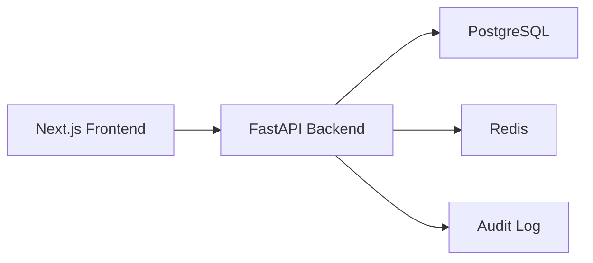

# Architecture

## Overview

## Frontend

- App Router based Next.js application in `frontend/`.
- Client-side auth stores the JWT in local storage for the MVP.
- The app shell provides sidebar navigation, top-bar identity display, and protected route behavior.
- Portal screens call backend APIs through `frontend/lib/api.ts`.

## Backend

- FastAPI application in `backend/app`.
- SQLAlchemy models define users, departments, policies, policy reviews, meetings, decisions, action items, and audit logs.
- Startup creates tables and seeds demo users when the database is empty.
- JWT auth and RBAC dependencies protect API routes.

## Data Model

- `User` belongs to an optional `Department` and has a role.
- `Policy` has an owner, version, lifecycle status, and optional effective date.
- `Meeting` can belong to a committee/department.
- `Decision` can belong to a meeting and can create follow-up `ActionItem` records.
- `AuditLog` records mutating backend actions with actor, entity, and timestamp.

