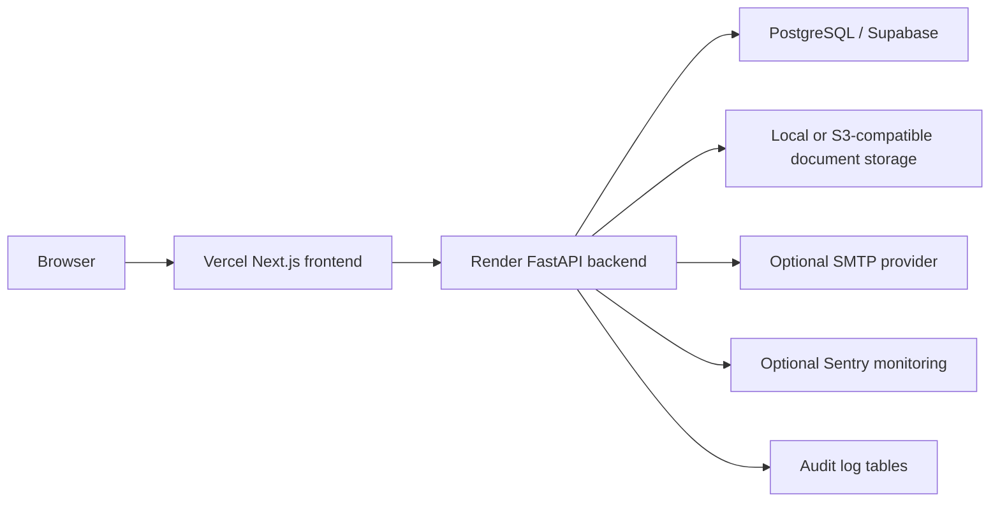

# Quorum GRC Project Guide

This guide explains the completed Quorum GRC MVP from product, engineering, deployment, and portfolio perspectives.

## Project Purpose

Quorum GRC is a full-stack demo/MVP application for managing governance operations in a centralized dashboard. It is designed as a portfolio-grade enterprise application, not a real production system for live company data.

The application solves a common organizational workflow problem: governance data is often spread across spreadsheets, emails, shared drives, meeting notes, and manual follow-ups. This portal brings those workflows into one structured system with role-based access.

## Final Project Status

The project is complete for its intended scope:

- Full-stack application implemented.
- Frontend deployed on Vercel.
- Backend deployed on Render.
- Database connected through PostgreSQL/Supabase.
- CI workflow passing on GitHub Actions.
- Production smoke checks passing for the deployed demo.
- Screenshots captured for portfolio and LinkedIn use.
- Release tag created: `v1.0.0-mvp`.
- Repository cleaned and pushed.

## Live Links

- Frontend demo: `https://<your-frontend>.vercel.app/`
- Backend health: `https://<your-backend>.onrender.com/health`
- Backend readiness: `https://<your-backend>.onrender.com/health/ready`
- GitHub repository: `https://github.com/ReneeeeeDev/quorum-grc`

## Main Concepts

### Governance

Governance is the system of policies, decisions, controls, responsibilities, and oversight that helps an organization operate consistently and accountably.

In this project, governance is represented through:

- Policies.
- Committees and departments.
- Meetings.
- Decisions.
- Action items.
- Audit logs.
- Compliance obligations.
- Risk records.
- Reports and dashboards.

### Policy Lifecycle

Policies move through lifecycle states:

- `draft`
- `review`
- `approval`
- `published`
- `archived`

This models how real organizations create, review, approve, publish, and retire governance policies.

### RBAC

RBAC means Role-Based Access Control. The app uses roles to decide what each user can see or change.

Implemented demo roles:

- Admin: full platform access.
- Governance Officer: governance write access.
- Manager: scoped access to owned or assigned work.
- Auditor: read-only access to governance evidence and audit records.
- Board Member: read-only access to board-relevant records.
- Public Auditor: limited demo auditor scope.

### Audit Trail

An audit trail records meaningful actions, such as login events, policy changes, action item updates, and record creation. It helps explain who did what and when.

### Smoke Testing

Smoke tests are quick checks that verify the most important deployed flows still work:

- Backend health.
- Database readiness.
- Login.
- Authenticated APIs.
- CORS.
- Pagination.
- Logout.

### Deployment Verification

Deployment verification confirms that the deployed frontend and backend are connected correctly and that the app works outside the local machine.

## Feature Modules

### Authentication

The backend uses JWT authentication. Users sign in with email and password, receive an access token, and the frontend uses that token for authenticated API calls.

### Dashboard

The dashboard summarizes governance KPIs:

- Open actions.
- Overdue items.
- Published policies.
- Pending approvals.
- Upcoming meetings.
- Documents.
- Unread alerts.
- Active integrations.

### Policies

The policy module manages governance policies and their lifecycle status. It supports role-aware visibility, server-side pagination metadata, and create/update/delete controls for authorized users.

### Committees and Departments

This module models governance structures such as committees, departments, and ownership groups.

### Meetings

The meetings module tracks governance meetings, dates, agendas, minutes, and committee ownership.

### Decisions

The decision register records decisions made in meetings or governance processes. These decisions can connect to action items for follow-up accountability.

### Action Items

Action items track assigned work, due dates, and completion state. Manager roles see only the work assigned or scoped to them.

### Documents

Document management supports metadata records, uploads, downloads, and optional S3-compatible storage configuration.

### Notifications

Notifications provide reminders, due-date alerts, and approval prompts. The backend records notification dispatch attempts.

### Calendar

Calendar events track meetings, reviews, audits, and renewals. The backend supports ICS export.

### Workflows

Workflow steps model approval processes, approvers, status, sequence, and comments.

### Compliance

Compliance obligations track governance or regulatory requirements, owners, evidence, due dates, and status.

### Risks

The risk register tracks risk category, severity, mitigation plan, owner, and status.

### Reports

Reports provide operational summaries and breakdowns for policies, actions, risk severity, compliance status, and upcoming meetings.

### Audit Logs

Audit logs provide a searchable and exportable record of key activity.

### Tenants

Tenant records model multiple organizations, subsidiaries, or business units.

### Integrations

Integration records model external governance, risk, compliance, and reporting systems. Sync runs record integration activity.

### SSO

SSO provider records model SAML/OIDC provider configuration. The MVP includes an SSO handoff simulation and mapped-user callback behavior.

### Settings

Settings include users, roles, and department assignment management.

## Technical Architecture



## Tech Stack

Frontend:

- Next.js App Router.
- TypeScript.
- Tailwind CSS with a custom design token palette and IBM Plex Sans (`next/font`).
- Client-side i18n (English, Spanish, Portuguese) with browser-language detection and a persisted switcher.
- Playwright tests.

Backend:

- FastAPI.
- SQLAlchemy.
- Pydantic.
- Alembic.
- JWT authentication.
- Passlib/bcrypt password hashing.

Database and services:

- PostgreSQL/Supabase.
- Redis in Docker Compose baseline.
- Optional S3-compatible document storage.
- Optional SMTP.
- Optional Sentry.

Deployment and CI:

- Vercel for frontend.
- Render for backend.
- GitHub Actions for CI.
- Docker Compose for local full-stack service baseline.

## Repository Structure

```text
frontend/      Next.js frontend app
backend/       FastAPI backend app
docs/          Detailed documentation
screenshots/   Final portfolio screenshot pack
scripts/       QA, smoke, and screenshot automation scripts
database/      Database notes
docker/        Infrastructure notes
```

## Important Scripts

Backend smoke check:

```bash
cd backend
python scripts/smoke_check.py
```

Frontend typecheck:

```bash
cd frontend
npm run typecheck
```

Translation dictionaries (fails on missing or unused keys):

```bash
cd frontend
npm run i18n:check
```

Frontend build:

```bash
cd frontend
npm run build
```

Production smoke check:

```bash
PRODUCTION_FRONTEND_URL=https://<your-frontend>.vercel.app \
PRODUCTION_BACKEND_URL=https://<your-backend>.onrender.com \
SMOKE_EMAIL=admin@quorum.local \
SMOKE_PASSWORD=Admin@123 \
node scripts/production-smoke.mjs
```

Role QA:

```bash
ROLE_QA_BACKEND_URL=https://<your-backend>.onrender.com node scripts/role-qa.mjs
```

Screenshot capture:

```bash
SCREENSHOT_FRONTEND_URL=https://<your-frontend>.vercel.app node scripts/capture-linkedin-screenshots.mjs
```

## Screenshots

The final screenshot pack is stored in:

```text
screenshots/
```

Recommended LinkedIn screenshots:

- `01-dashboard.png`
- `02-policies.png`
- `06-action-items.png`
- `07-documents.png`
- `12-risks.png`
- `13-reports.png`
- `14-audit-logs.png`
- `26-auditor-read-only-policies.png`
- `29-board-published-policies.png`
- `50-mobile-dashboard.png`

## What This Project Demonstrates

This project demonstrates practical full-stack skills:

- Planning a domain-driven MVP.
- Designing role-based workflows.
- Building REST APIs.
- Building a protected frontend app shell.
- Managing auth state.
- Implementing RBAC.
- Handling CORS and deployment configuration.
- Using PostgreSQL-backed models.
- Creating seed data for realistic demos.
- Writing CI workflows.
- Running smoke tests.
- Capturing portfolio screenshots.
- Writing developer and deployment documentation.

## MVP Boundaries

This is a portfolio/demo MVP. It is not intended to be used with real organizational data without additional real-production setup.

Not required for the portfolio version:

- Real SMTP sender setup.
- Real Sentry project setup.
- Real S3 bucket setup.
- Real customer/user onboarding.
- Real legal/compliance data.
- Live SAML/OIDC assertion validation.

Those are production operations and integrations, not blockers for the completed demo project.

## Completion Summary

The project is closed as a completed portfolio MVP. It is suitable for:

- LinkedIn project posts.
- Resume project section.
- Internship applications.
- Full-stack portfolio review.
- Interview discussion.
